# NOIZEUS Dataset

We use the [NOIZEUS](https://ecs.utdallas.edu/loizou/speech/noizeus/) dataset which contains 30 IEEE sentences (produced by three male and three female speakers) corrupted by 8 different real-world noises at different SNRs of 0, 5, 10 and 15 each. The noise includes suburban train noise, babble, car, exhibition hall, restaurant, street, airport and train-station noise. Our testset is created by randomly sampling from the distorted speech samples and keeping the clean speeches intact.

We can visualize some audio samples in our testset by seeing the audio waveforms and the spectrograms and we can categorize our testset into noise event classes as well as SNR ratios.

## Clean audio

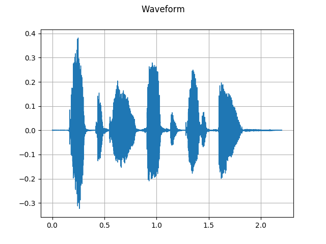 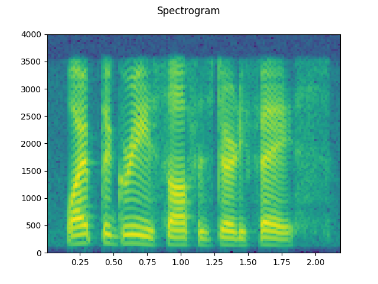

## Noise Event 

Let's see the effect of different noise classes on our clean audio(each of them at SNR=0)-

### Babble

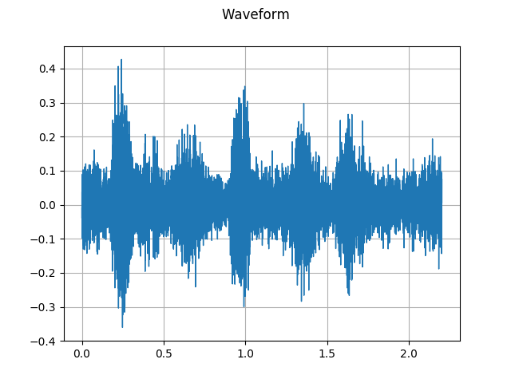 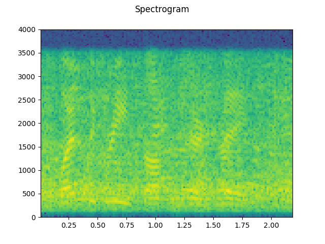

### Airport

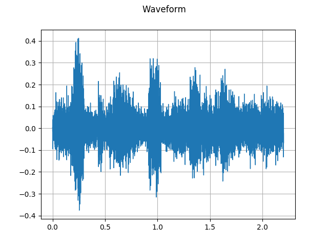 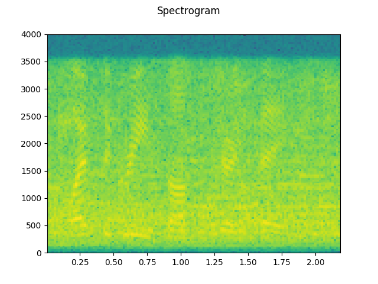

### Exhibition

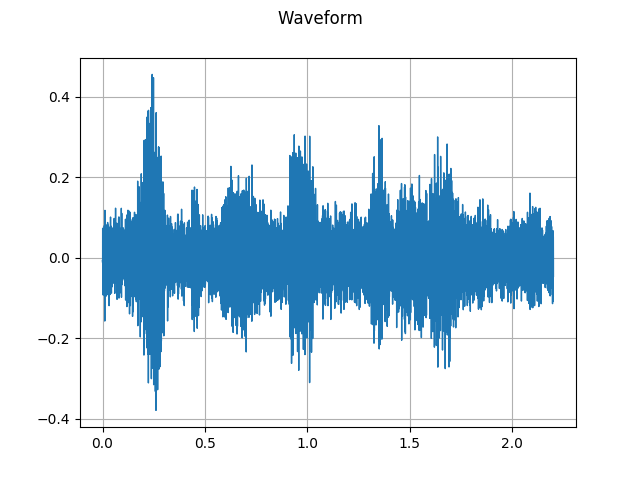 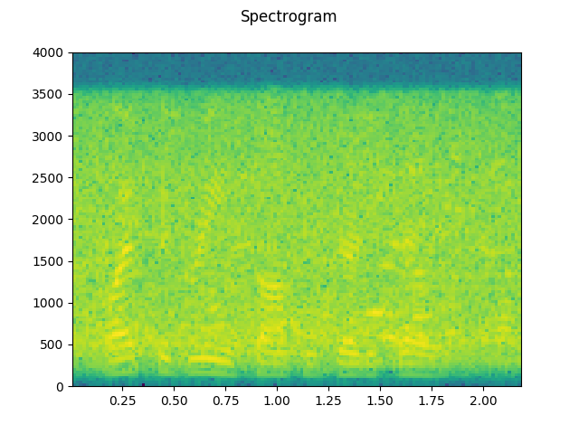

### Street

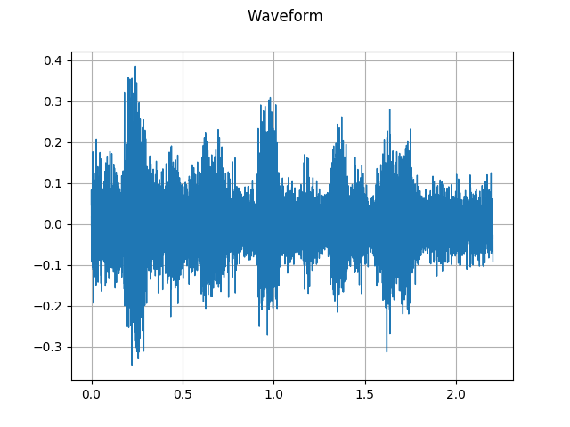 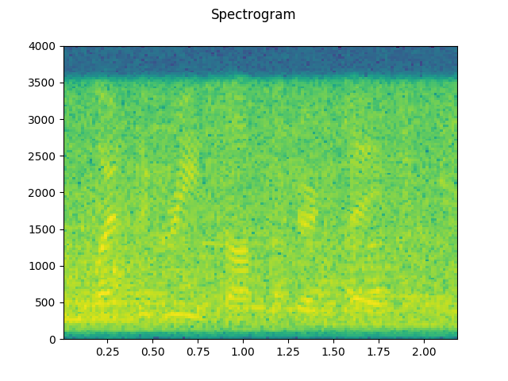

### Restaurant

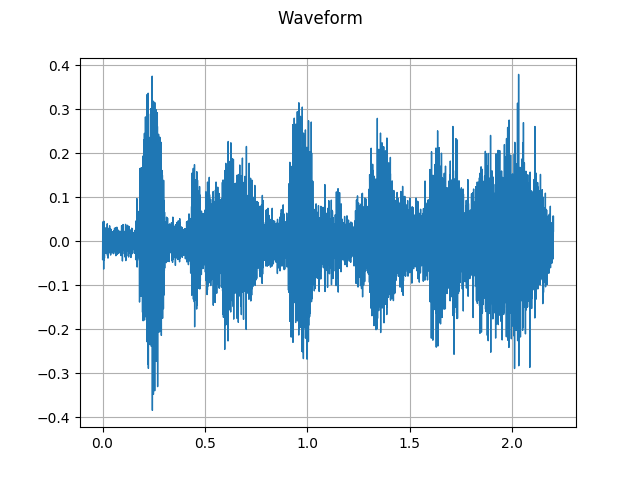 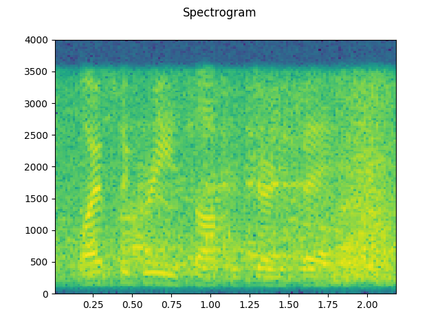

### Car

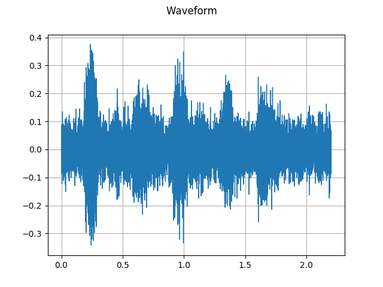 

### Train

 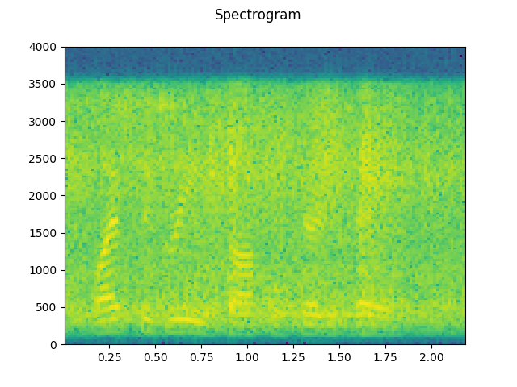

### Station

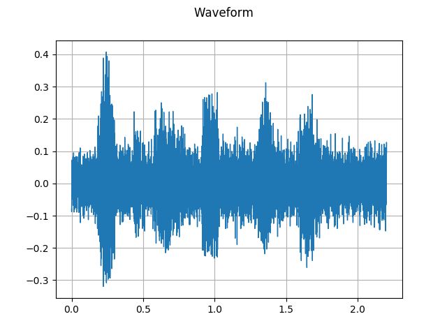 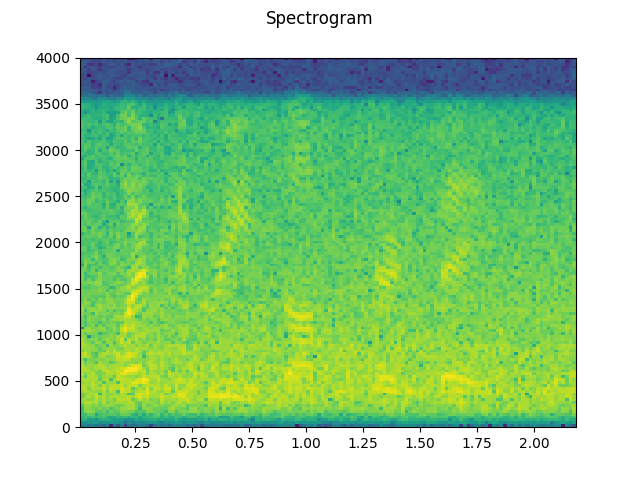

## SNR Ratios

Let's us now view the same audio sample recorded within the same noise class (station) and varying SNR ratios-

### SNR = 5 

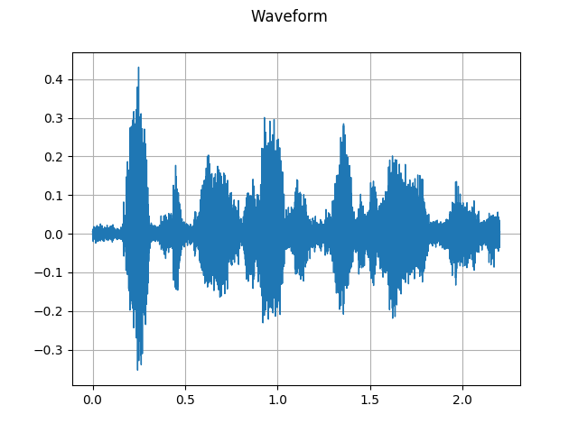 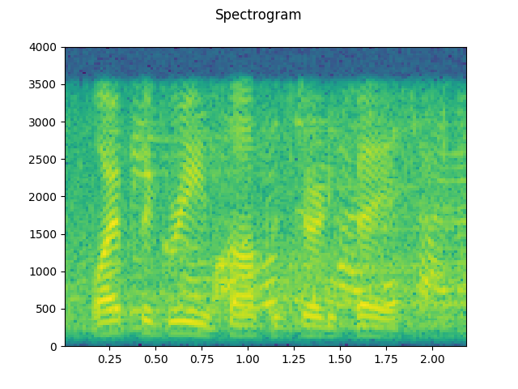

### SNR = 10

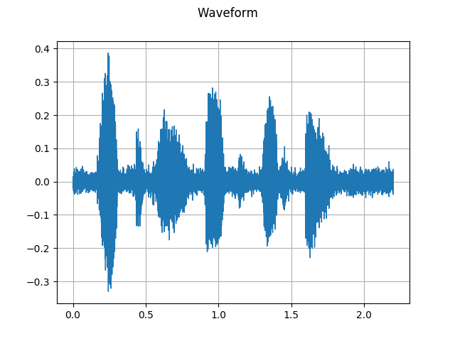 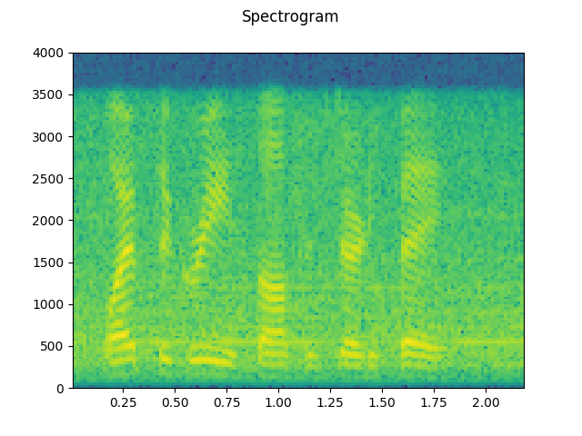

### SNR = 15

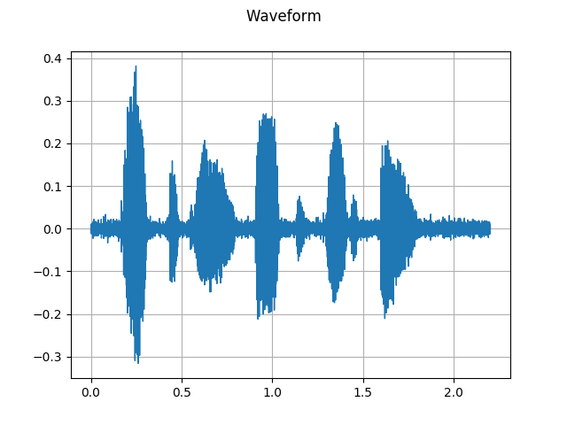 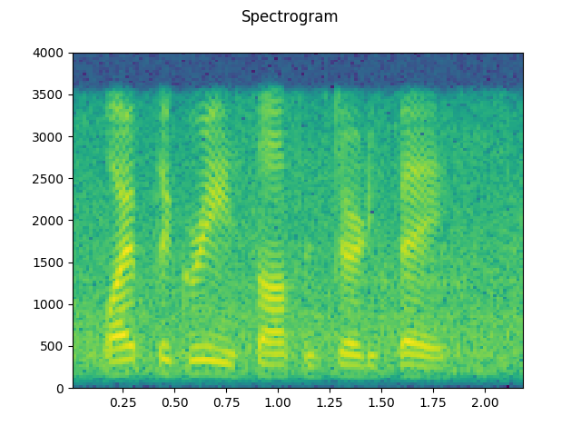