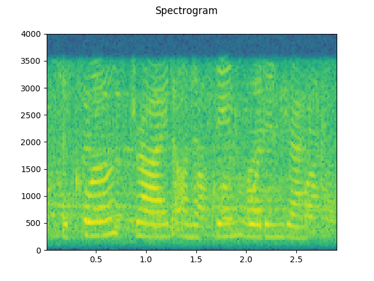
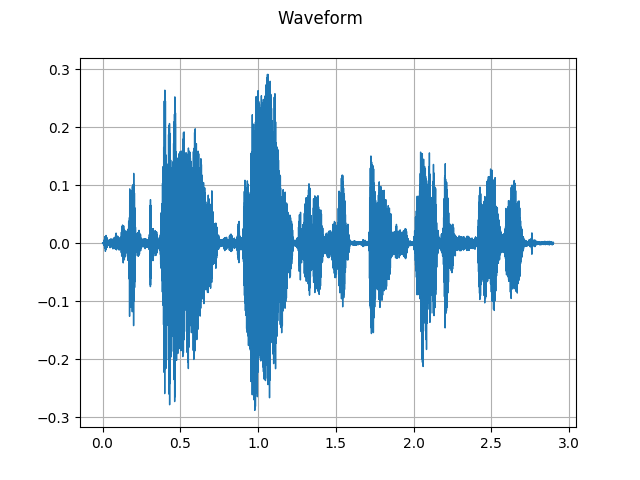
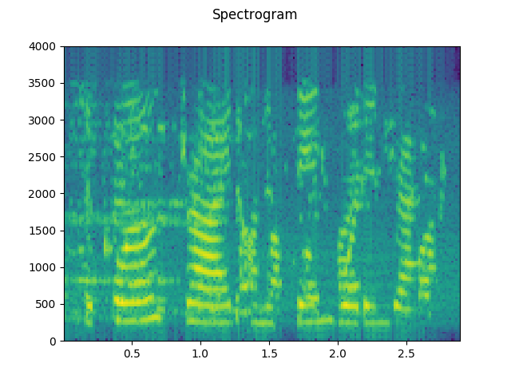
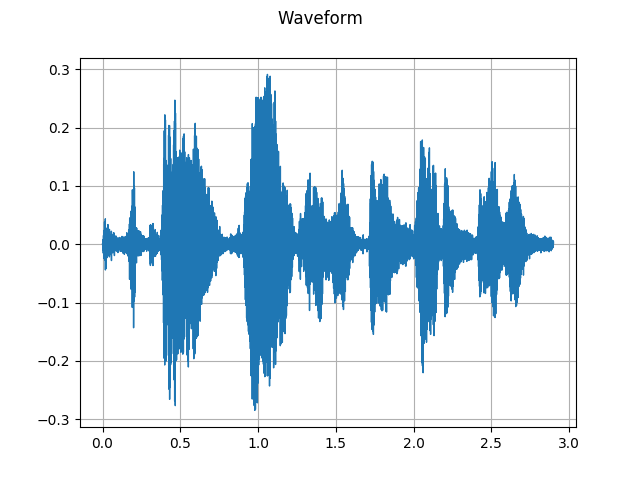
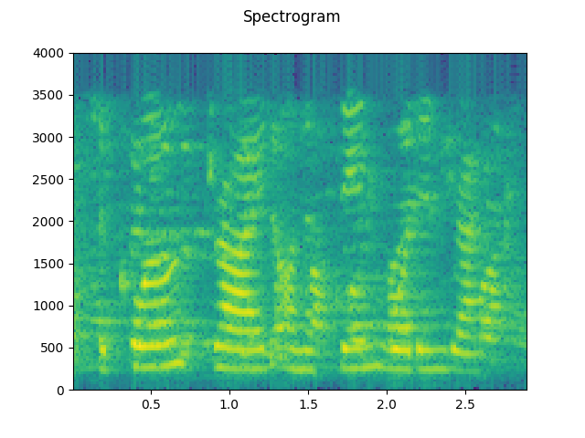
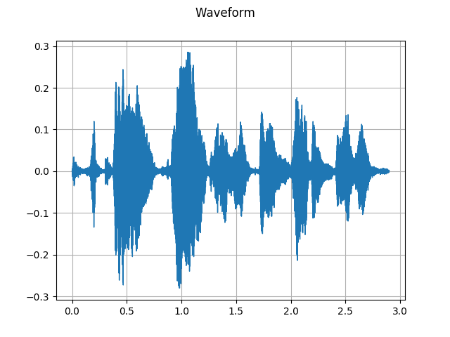
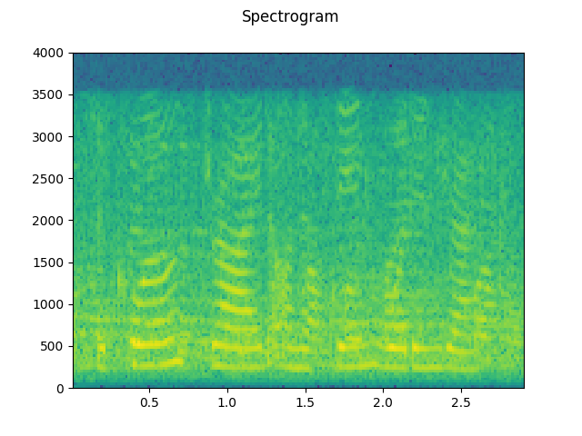
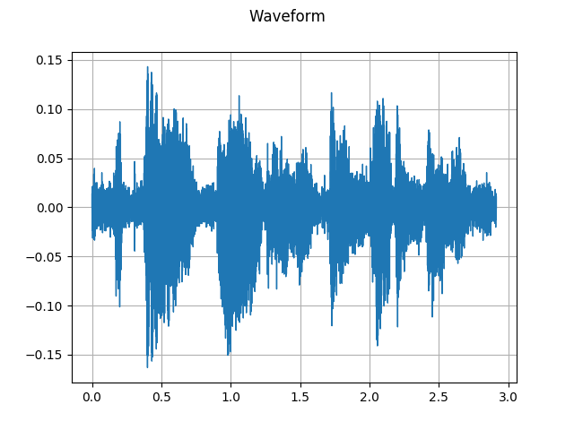

## Signal Processing Techniques for Speech Enhancement

In this section we explore the various traditional signal processing filters for noise reduction and speech enhancement using the available literature and test them out on samples in our Testset. We visualize our audio samples and the effects our filters have on them by plotting their audio waveforms and spectrograms.

### Clean Audio Sample

 

### Noisy Audio Sample (SNR = 15)

 

### Spectral Subtraction

  

### Bayesian MMSE Filter

  

### Bayesian Log MMSE Filter

 

### Weiner Filter

  

### Kalman Filter

  